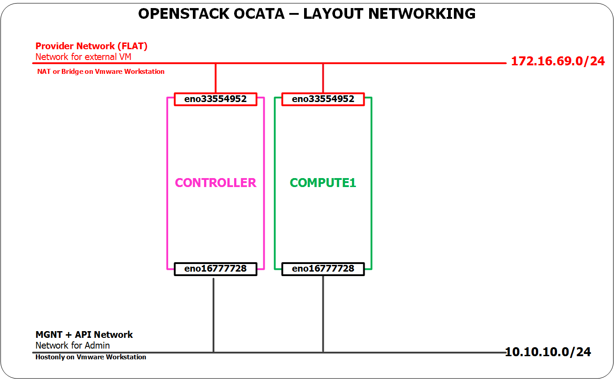

### Hương dẫn cài đặt OpenStack Ocata bằng Packstack trên CENTOS 7.x

## Chuẩn bị

- Distro: CentOS 7.x

### Mô hình



### IP Planning


### Các bước chuẩn bị trên trên Controller


- Thiết lập hostname

	```sh
	hostnamectl set-hostname controller
	```

- Thiết lập IP 

    ```sh
    echo "Setup IP  eno16777728"
    nmcli c modify eno16777728 ipv4.addresses 10.10.10.30/24
    nmcli c modify eno16777728 ipv4.method manual

    echo "Setup IP  eno33554952"
    nmcli c modify eno33554952 ipv4.addresses 172.16.69.30/24
    nmcli c modify eno33554952 ipv4.gateway 172.16.69.1
    nmcli c modify eno33554952 ipv4.dns 8.8.8.8
    nmcli c modify eno33554952 ipv4.method manual


    sudo systemctl disable firewalld
    sudo systemctl stop firewalld
    sudo systemctl disable NetworkManager
    sudo systemctl stop NetworkManager
    sudo systemctl enable network
    sudo systemctl start network

    sed -i 's/SELINUX=enforcing/SELINUX=disabled/g' /etc/sysconfig/selinux

    ```
- Khai báo repos cho OpenStack Ocata

   ```sh
    sudo yum install -y centos-release-openstack-ocata
    yum update -y

    sudo yum install -y wget crudini
    yum install -y openstack-packstack
    init 6
    ```


### Các bước chuẩn bị trên trên Compute1

- Thiết lập hostname

    ```sh
    hostnamectl set-hostname compute1
    ```

- Thiết lập IP 

    ```sh
    echo "Setup IP  eno16777728"
    nmcli c modify eno16777728 ipv4.addresses 10.10.10.31/24
    nmcli c modify eno16777728 ipv4.method manual

    echo "Setup IP  eno33554952"
    nmcli c modify eno33554952 ipv4.addresses 172.16.69.31/24
    nmcli c modify eno33554952 ipv4.gateway 172.16.69.1
    nmcli c modify eno33554952 ipv4.dns 8.8.8.8
    nmcli c modify eno33554952 ipv4.method manual


    sudo systemctl disable firewalld
    sudo systemctl stop firewalld
    sudo systemctl disable NetworkManager
    sudo systemctl stop NetworkManager
    sudo systemctl enable network
    sudo systemctl start network

    sed -i 's/SELINUX=enforcing/SELINUX=disabled/g' /etc/sysconfig/selinux
    ```

- Khai báo repos cho OpenStack Ocata

   ```sh
    sudo yum install -y centos-release-openstack-ocata
    yum update -y

    sudo yum install -y wget crudini
    yum install -y openstack-packstack
    init 6
    ```

### Bắt đầu cài đặt `packstack` trên trên Controller

- Cài đặt với mô hình Provider network và self service network. Lưu ý: khi cài xong bước này, máy ảo có thể gắn vào dải `provider` hoặc `selfservice`
- SSH vào máy chủ Controller
- Sử dụng lệnh dưới để cài OpenStack.
- Khi cài, màn hình sẽ yêu cầu nhập mật khẩu của các máy COM1 và COM2, packstack sẽ tự động cài trên các máy này mà ko cần thao tác.

- Kết thúc quá trình cài, màn hình sẽ có thông báo để sử dụng OpenStack


    ```sh
    packstack --allinone \
        --default-password=Welcome123 \
        --os-cinder-install=y \
        --os-ceilometer-install=y \
        --os-trove-install=n \
        --os-ironic-install=n \
        --nagios-install=n \
        --os-swift-install=y \
        --os-gnocchi-install=y \
        --os-aodh-install=y \
        --os-neutron-ovs-bridge-mappings=extnet:br-ex \
        --os-neutron-ovs-bridge-interfaces=br-ex:eno33554952 \
        --os-neutron-ovs-bridges-compute=br-ex \
        --os-neutron-ml2-type-drivers=vxlan,flat \
        --os-controller-host=172.16.69.30 \
        --os-compute-hosts=172.16.69.31 \
        --os-neutron-ovs-tunnel-if=eno16777728 \
        --provision-demo=n
	```

###  Upload images, tạo network, chỉnh rule

### Upload image, tạo network, router , máy ảo

- Thực thi biến môi trường

    ```sh
    source ~/keystonerc_admin
    ```

- Upload images

```sh
curl http://download.cirros-cloud.net/0.3.4/cirros-0.3.4-x86_64-disk.img | glance \
image-create --name='cirros' \
--visibility=public \
--container-format=bare \
--disk-format=qcow2
```

- Tạo network public 

    ```sh
    neutron net-create external_network --provider:network_type flat \
    --provider:physical_network extnet  \
    --router:external \
    --shared
    ```

- Tạo subnet trong network public 

    ```sh
    neutron subnet-create --name public_subnet \
    --enable_dhcp=False \
    --allocation-pool=start=172.16.69.80,end=172.16.69.100 \
    --gateway=172.16.69.1 external_network 172.16.69.0/24
    ```

- Tạo network private

    ```sh
    neutron net-create private_network
    neutron subnet-create --name private_subnet private_network 10.0.0.0/24 \
    --dns-nameserver 8.8.8.8
    ```

- Tạo router và addd các interface

    ```sh
    neutron router-create router
    neutron router-gateway-set router external_network
    neutron router-interface-add router private_subnet
    ```

- Truy cập vào web để tạo máy ảo.