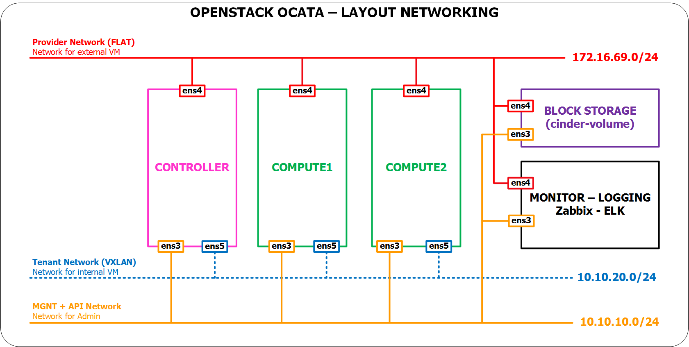
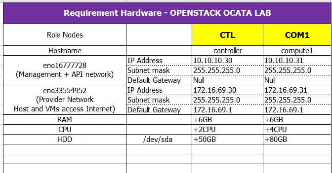

# Hướng dẫn cài đặt OpenStack Ocata trên Ubuntu Server 16.04 64 bit

## Chuẩn bị

- Distro: Ubuntu server 16.04 - 64 bit

## Mô hình



## IP Planning



# Các bước chuẩn bị trên trên Controller

## Thiết lập hostname và khai báo các host cho máy chủ `Controller`

- Thực hiện lệnh cập nhật các gói cài đặt cho Controller
    ```sh
    apt-get update -y
    ```

- Thiết lập hostname
    ```sh
    hostnamectl set-hostname controller1
    ```

- Khai báo các host
    ```sh
    cp /etc/hosts /etc/hosts.orig

    cat << EOF > /etc/hosts
    127.0.0.1   localhost controller1
    10.10.10.50 controller1
    10.10.10.61 compute1
    EOF
    ```


## Thiết lập IP cho các card mạng

- Sao lưu file cấu hình network
    ```sh
    cp  /etc/network/interfaces /etc/network/interfaces.orig
    ```

- Khai báo IP cho 3 NICs theo thứ tự 
    ```sh
    cat << EOF > /etc/network/interfaces

    source /etc/network/interfaces.d/*

    # The loopback network interface
    auto lo
    iface lo inet loopback

    # Management Network (MGNT)
    auto ens32
    iface ens32 inet static
    address 10.10.10.50
    netmask 255.255.255.0

    # Provider Network (EXT)
    auto ens33
    iface ens33 inet static
    address 172.16.69.50
    netmask 255.255.255.0
    gateway 172.16.69.1
    dns-nameservers 8.8.8.8

    # DATA VMs Network (DATA)
    auto ens34
    iface ens34 inet static
    address 10.10.20.50
    netmask 255.255.255.0

    EOF
    ```

- Nếu cần thì khởi động lại network trên máy Controller, sau khi khởi động thì đăng nhập bằng IP của dải MGNT (`ens33: 10.10.10.50`).
    ```sh
    systemctl restart networking
    ```

## Cài đặt NTP server (Network Time Protocol) trên Controller

- Cài đặt gói `chrony` cho NTP server
    ```sh
     apt install -y chrony
    ```

- Sao lưu file cấu hình của NTP Server
    ```sh
    cp /etc/chrony/chrony.conf /etc/chrony/chrony.conf.orig
    ```

- Cấu hình NTP server
    ```sh
    echo "server 1.vn.pool.ntp.org iburst 
    server 0.asia.pool.ntp.org iburst 
    server 3.asia.pool.ntp.org iburst

    allow 10.10.10.0/24" >> /etc/chrony/chrony.conf
    ```

- Khởi động lại dịch vụ NTP trên Controller
    ```sh
    serivce chrony restart
    ```

- Kiểm tra dịch vụ NTP đã hoạt động hay chưa
    ```sh
    chronyc sources
    ```

    -Kết quả là:
        ```sh
        210 Number of sources = 9
        MS Name/IP address         Stratum Poll Reach LastRx Last sample
        ===============================================================================
        ^* time.vng.vn                   2   6    17     1  -2297us[-8419us] +/-  119ms
        ^+ mail.khangthong.vn            2   6    17     0    +17ms[  +17ms] +/-  146ms
        ^+ mail.khangthong.vn            2   6    17     1    +17ms[  +11ms] +/-  142ms

        ^? 2001:14e8::25                 0   6     0   10y     +0ns[   +0ns] +/-    0ns
        ^? 2001:b030:242b:ff00::1        0   6     0   10y     +0ns[   +0ns] +/-    0ns
        ^? 240f:e1:3bc9:1::123           0   6     0   10y     +0ns[   +0ns] +/-    0ns
        ^? 2001:da8:9000::130            0   6     0   10y     +0ns[   +0ns] +/-    0ns
        ^+ 209.58.185.100                2   6    17     6    -54ms[  -60ms] +/-  323ms
        ^- 61-216-153-104.HINET-IP.h     3   6    17     5    +15ms[  +15ms] +/-   84ms
        ```

## Khai báo repos cho OpenStack Ocata trên Controller

- Khai báo repos của OpenStack Ocata

    ```sh
    apt install -y software-properties-common
    add-apt-repository -y cloud-archive:ocata
    ```
- Thực hiện update máy chủ Controller sau khi khai báo repos và khởi động lại máy chủ.
    ```sh
    apt-get update -y && apt-get upgrade -y && apt-get dist-upgrade -y && init 6
    ```

- Đăng nhập với vào máy chủ Controller và chuyển sang quyền root
    ```sh
    su -
    ```

- Cài đặt gói OpenStack Client
    ```sh
    apt install -y python-openstackclient
    ```

## Cài đặt SQL Server (hướng dẫn này sử dụng MaraiDB)

- Khai báo mật khẩu cho tài khoản `root` trong MariaDB
    ```sh
    echo mariadb-server-10.0 mysql-server/root_password VietStack6789 | \
        debconf-set-selections
    echo mariadb-server-10.0 mysql-server/root_password_again VietStack6789 | \
        debconf-set-selections

- Cài đặt gói của MariaDB
    ```sh
    apt install -y mariadb-server python-pymysql
    ```

- Tạo file cấu hình MariaDB dành cho các databasse OpenStack
    ```sh
    echo << EOF > /etc/mysql/mariadb.conf.d/99-openstack.cnf
    [mysqld]
    bind-address = 0.0.0.0

    default-storage-engine = innodb
    innodb_file_per_table = on
    max_connections = 4096
    collation-server = utf8_general_ci
    character-set-server = utf8
    EOF
    ```

mysql -u root -e'source /root/config.sql'
rm -rf /root/config.sql
```

- Khởi động lại dịch vụ MariaDB
    ```sh
    service mysql restart
    ```

- Bỏ qua bước thiết lập các bảo mật cho MariaDB (sẽ thực hiện sau)

## Cài đặt Message queue (RabbitMQ)

- Tải gói rabbitmq
    ```sh
     apt install -y rabbitmq-server
    ```

- Tạo user `openstack` cho rabbitmq với mật khẩu là `VietStack6789`
    ```sh
    rabbitmqctl add_user openstack VietStack6789
    ```

- Phân quyền trong rabbitmq đối với user `openstack` vừa tạo
    ```sh
    rabbitmqctl set_permissions openstack ".*" ".*" ".*"
    ```

## Cài đặt `Memcached`

- Tải gói `memcached`
    ```sh
    apt install -y memcached python-memcache
    ```

- Cấu hình memcached
    ```sh
    cp /etc/memcached.conf /etc/memcached.conf.orig

    sed -i 's/-l 127.0.0.1/-l 10.10.10.50/g' /etc/memcached.conf
    ```

- Khởi động lại memcached
    ```sh
    systemctl enable memcached.service
    systemctl start memcached.service
    ```

- 

# Keystone trên Controller
## Cài đặt và cấu hình Keystone
### Tạo database cho keystone

- Tạo database cho keystone
    ```sh
    cat << EOF | mysql -uroot -pVietStack6789
    CREATE DATABASE keystone default character set utf8;
    GRANT ALL PRIVILEGES ON keystone.* TO 'keystone'@'localhost' IDENTIFIED BY 'VietStack6789' WITH GRANT OPTION;
    GRANT ALL PRIVILEGES ON keystone.* TO 'keystone'@'%' IDENTIFIED BY 'VietStack6789' WITH GRANT OPTION;
    FLUSH PRIVILEGES;
    EOF
    ```

### Cài đặt và cấu hình keystone
